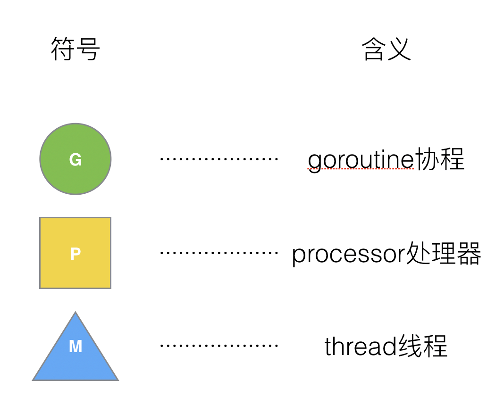

## 什么是GMP

G:goroutine协程,创建一个约2kb大小。
M:thread线程,
P:processor处理器,包含了运行goroutine的资源。如果线程想运行goroutine必须先获取P，
P中还包含了可运行的G队列。
- 在go中线程是运行goroutine的实体，调度器的功能是把可运行的goroutine分配到工作线程上。
- 调度器和os调度器是通过M结合起来的，每个M都代表了一个内核线程，OS调度器负责把内核线程分配到CPU的核上执行。
### P和M何时会被创建
1. P 何时创建：在确定了 P 的最大数量 n 后，运行时系统会根据这个数量创建 n 个 P。
2. M 何时创建：没有足够的 M 来关联 P 并运行其中的可运行的 G。比如所有的 M 此时都阻塞住了，而 P 中还有很多就绪任务，就会去寻找空闲的 M，而没有空闲的，就会去创建新的 M。
### 特殊M0和G0
- M0: M0 是启动程序后的编号为 0 的主线程，这个 M 对应的实例会在全局变量 runtime.m0 中，不需要在 heap 上分配，M0 负责执行初始化操作和启动第一个 G， 在之后 M0 就和其他的 M 一样了。

- G0: 是每次启动一个M都会第一个创建的goroutine，G0仅用于负责调度的G，G0不指向任何可执行的函数，每个M都会有一个自己的G0。在调度或系统调用时会使用G0的栈空间，全局变量的G0是M0的G0。
## GMP模型

1. 全局队列（Global Queue）：存放等待运行的 G。
2. P 的本地队列：同全局队列类似，存放的也是等待运行的 G，存的数量有限，不超过 256 个。新建 G’时，G’优先加入到 P 的本地队列，如果队列满了，则会把本地队列中一半的 G 移动到全局队列。
3. P 列表：所有的 P 都在程序启动时创建，并保存在数组中，最多有 GOMAXPROCS(可配置) 个。
4. M：线程想运行任务就得获取 P，从 P 的本地队列获取 G，P 队列为空时，M 也会尝试从全局队列拿一批 G 放到 P 的本地队列，或从其他 P 的本地队列偷一半放到自己 P 的本地队列。M 运行 G，G 执行之后，M 会从 P 获取下一个 G，不断重复下去。

## GMP调度流程

## work stealing 机制
当本线程无可运行的G时，尝试从其他线程绑定的P偷取一半G，而不是销毁线程。
## hand off 机制
当本线程因为G进行系统调用堵塞时，线程释放绑定的P，把P转移给其他空闲的线程执行。

## 总结

引用

[1]: [Golang 调度器 GMP 原理与调度全分析](https://learnku.com/articles/41728)