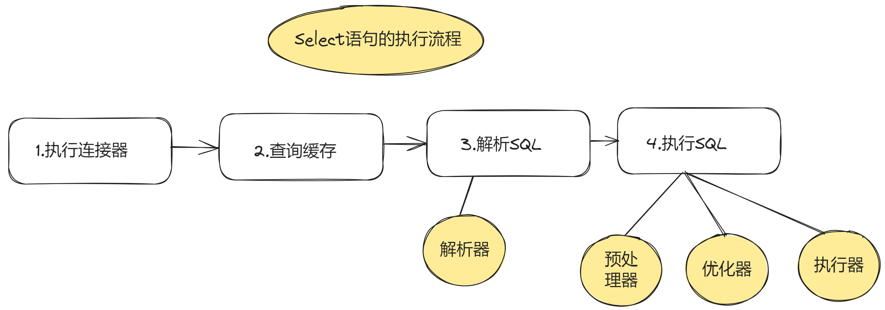

## SELECT的执行流程

1. 连接器：建立连接，管理连接，校验身份
2. 查询缓存：查询语句如果命中缓存则直接返回，否则继续往下执行。Mysql 8.0已删除。
3. 解析SQL：通过解析器对SQL查询进行词法分析，语法分析，然后构建语法树
4. 执行SQL：执行SQL共有三个阶段
- 预处理阶段：检查表或字段是否存在，将`selct *`中的`*`符号扩展为表上所有的列
- 优化阶段：基于查询成本考虑，选择查询成本最小的执行计划
- 执行阶段：根据执行计划执行SQL查询语句，从存储引擎读取记录，返回给客户端  、

## 数据是怎么存储的
MySql硬盘文件  
*.opt：存储当前数据库的默认字符集和字符校检规则  
*.frm：存储表结构  
*.ibd：存储表数据  
### 表空间文件的结构是怎么样的？
表空间由段（segment）、区（extent）、页（page）、行（row）组成 

1. 行: 数据库表中的记录都是按行进行存放的，每行记录根据不同的行格式，有不同的存储结构。
2. 页：记录是按行来存储的，但是数据库并不以`行`为单位，否则一次读取就是一次I/O操作。InnoDB的数据是按`页`为单位来读取的
，默认每个页的大小为16kb。
3. 区：在表中数据量大的时候，为某个索引分配空间的时候就不再按照页为单位分配了，而是按照区（extent）为单位分配。每个区的大小为 1MB，对于 16KB 的页来说，连续的 64 个页会被划为一个区，这样就使得链表中相邻的页的物理位置也相邻，就能使用顺序 I/O 了
4. 段：表空间是由各个段（segment）组成的，段是由多个区（extent）组成的
### InnoDB 行格式有哪些？
InnoDB 提供了 4 种行格式，分别是 Redundant、Compact、Dynamic和 Compressed 行格式。
- Redundant 是很古老的行格式了， MySQL 5.0 版本之前用的行格式，现在基本没人用了。
- Compact 是一种紧凑的行格式，设计的初衷就是为了让一个数据页中可以存放更多的行记录，从 MySQL 5.1 版本之后，行格式`默认设置成 Compact。`
- Dynamic 和 Compressed 两个都是紧凑的行格式，它们的行格式都和 Compact 差不多。`从 MySQL5.7 版本之后，默认使用 Dynamic 行格式`

Compact格式：
1. 变长字段长度列表：varchar(n) 和 char(n) 的区别是什么，相信大家都非常清楚，char 是定长的，varchar 是变长的，变长字段实际存储的数据的长度（大小）不固定的。`「变长字段长度列表」的信息是按照逆序存放的`

2. NULL值列表：表中的某些列可能会存储 NULL 值，Compact 行格式把这些值为 NULL 的列存储到 NULL值列表中`默认占1个字节`
如果存在允许 NULL 值的列，则每个列对应一个二进制位（bit），二进制位按照列的顺序逆序排列。
3. 记录头信息：delete_mask标识是否被删除，next_record下一条记录的位置

二进制位的值为1时，代表该列的值为NULL。  
二进制位的值为0时，代表该列的值不为NULL。

### varchar(n) 中 n 最大取值为多少？
- MySQL 规定除了 TEXT、BLOBs 这种大对象类型之外，其他所有的列（不包括隐藏列和记录头信息）占用的字节长度加起来不能超过 65535 个字节。
- 一行数据的最大字节数 65535，其实是包含「变长字段长度列表」和 「NULL 值列表」所占用的字节数的。所以， 我们在算 varchar(n) 中 n 最大值时，需要减去 storage overhead 占用的字节数。
- 如果有多个字段的话，要保证所有字段的长度 + 变长字段字节数列表所占用的字节数 + NULL值列表所占用的字节数 <= 65535。
### 行溢出后，MySQL 是怎么处理的？
发生行溢出，多的数据就会存到另外的「溢出页」中。

## 索引
按「数据结构」分类：B+tree索引、Hash索引、Full-text索引。  
按「物理存储」分类：聚簇索引（主键索引）、二级索引（辅助索引）。  
按「字段特性」分类：主键索引、唯一索引、普通索引、前缀索引。  
按「字段个数」分类：单列索引、联合索引。

`创建的主键索引和二级索引默认使用的是 B+Tree 索引。`

主键索引的 B+Tree 和二级索引的 B+Tree 区别如下：

- 主键索引的 B+Tree 的叶子节点存放的是实际数据，所有完整的用户记录都存放在主键索引的 B+Tree 的叶子节点里；
- 二级索引的 B+Tree 的叶子节点存放的是主键值，而不是实际数据。

### B+树
B+Tree 是一种多叉树，叶子节点才存放数据，非叶子节点只存放索引，而且每个节点里的数据是按主键顺序存放的。
每一层父节点的索引值都会出现在下层子节点的索引值中，因此在叶子节点中，包括了所有的索引值信息，并且每一
个叶子节点都有两个指针，分别指向下一个叶子节点和上一个叶子节点，形成一个双向链表。

优点:  
B+Tree 存储千万级的数据只需要 3-4 层高度就可以满足，这意味着从千万级的表查询目标数据最多需要 3-4 次磁盘 I/O，
所以B+Tree 相比于 B 树和二叉树来说，最大的优势在于查询效率很高，因为即使在数据量很大的情况，查询一个数据的磁盘 I/O 依然维持在 3-4次。

### 回表
如果我用 product_no 二级索引查询商品，如下查询语句：
`select * from product where product_no = '0002';`
会先检二级索引中的 B+Tree 的索引值（商品编码，product_no），找到对应的叶子节点，然后获取主键值，然后再通过主键索引中的 B+Tree 树查询到对应的叶子节点，然后获取整行数据。这个过程叫「回表」，也就是说要查两个 B+Tree 才能查到数据。
### 覆盖索引
在二级索引的 B+Tree 就能查询到结果的过程就叫作「覆盖索引」，也就是只需要查一个 B+Tree 就能找到数据。
### Mysql什么使用B+树而不适用B树
B+树只在叶子节点存储数据，而B树的非叶子节点也要存储数据，所以B+树的单个节点的数据量更小，在相同的磁盘I/O次数下，就更查询更多的节点。
### 为什么不适用Hash索引
hash索引适合单个查询，不适用于进行范围查询

### 什么时候适用索引？
- 字段有唯一限制的，比如商品编码
- 经常用于`where`条件的
- 经常用于`GROUP BY`和`ORDER BY`的字段。这样在查询的时候就不需要再去做一次排序，因为我们知道建立索引之后再B+树的记录是排序号的

### 有什么优化索引的方法？
- 前缀索引优化；
- 覆盖索引优化；
- 主键索引最好是自增的

InnoDB 创建主键索引默认为聚簇索引，数据被存放在了 B+Tree 的叶子节点上。也就是说，同一个叶子节点内的各个数据是按主键顺序存放的，因此，每当有一条新的数据插入时，数据库会根据主键将其插入到对应的叶子节点中。

如果我们使用自增主键，插入一条新记录，都是追加操作，不需要重新移动数据，因此这种插入数据的方法效率非常高。

如果我们使用非自增主键，每次插入主键的索引值都是随机的，因此每次插入新的数据时，就可能会插入到现有数据页中间的某个位置，这将不得不移动其它数据来满足新数据的插入,`通常将这种情况称为页分裂。页分裂还有可能会造成大量的内存碎片，导致索引结构不紧凑，从而影响查询效率。`

- 防止索引失效；
- 索引最好设置为 NOT NULL

## 事务
### 事务有哪些特性
- 原子性
- 一致性
- 隔离性
- 持久性
### 并行事务会引发什么问题？
1. 脏读
如果一个事务读到了另一个 未提交事务修改过的数据 ，就意味着发生了脏读

2. 不可重复读
在一个事务内多次读取同一个数据，如果出现前后两次读到的数据不一样的情况，就意味着发生了 不可重复读 现象。

3. 幻读
在一个事务内多次查询某个符合查询条件的 记录数量，如果出现前后两次查询到的记录数量不一样，就意味着发生了幻读现象

三者严重性：

### 事务的隔离级别有哪些？
- 读未提交：一个事务还没提交时，他做的变更就能被其他事务看到
- 读已提交：一个事务提交后，他做的变更就能被其他事务看到
- 可重复读：一个事务执行过程中看到的数据，一直跟这个事务启动时看到的数据是一致的，`Mysql InnoDB引擎的默认隔离级别`
- 串行化：会对记录加上锁，在多个事务对这条记录进行读写操作是，如果发生了冲突的时候，后访问的事务必须等待前一个事务实行完成。
#### 四种隔离级别具体是如何实现的呢
- 对于「读未提交」隔离级别的事务来说，因为可以读到未提交事务修改的数据，所以直接读取最新的数据就好了
- 对于「串行化」隔离级别的事务来说，通过加读写锁的方式来避免并行访问
- 对于「读提交」和「可重复读」隔离级别的事务来说，它们是通过 Read View 来实现的，它们的区别在于创建 Read View 的时机不同，大家可以把 Read View 理解成一个数据快照，就像相机拍照那样，定格某一时刻的风景。「读提交」隔离级别是在「每个语句执行前」都会重新生成一个 Read View，而「可重复读」隔离级别是「启动事务时」生成一个 Read View，然后整个事务期间都在用这个 Read View。

启动事务:
- 执行了 `begin/start transaction` 命令后，并不代表事务启动了。只有在执行这个命令后，执行了第一条 select 语句，才是事务真正启动的时机；
- 执行了 `start transaction with consistent snapshot` 命令，就会马上启动事务。