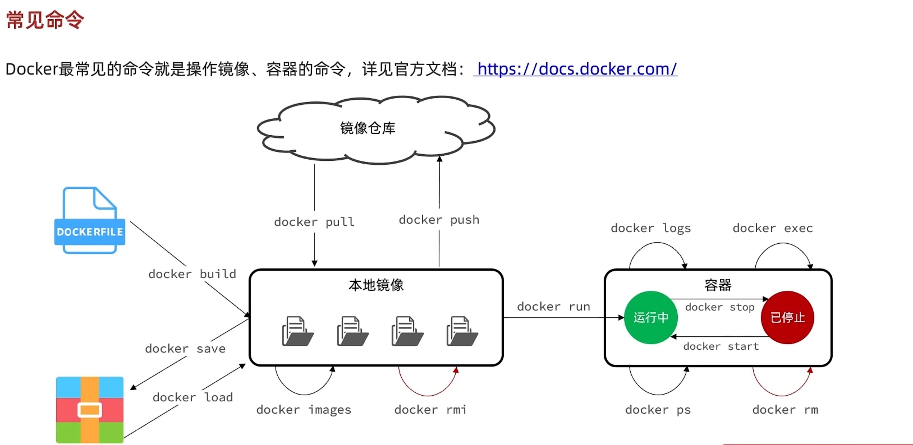
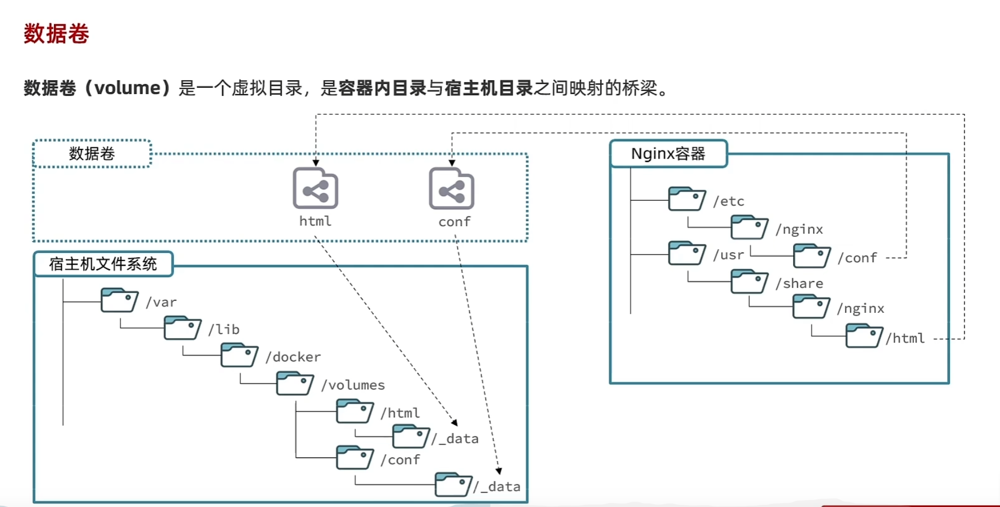

+++
author = "屑莹"
title = "docker学习"
date = 2023-01-22T23:32:50+08:00
description = ""
categories = [
    "编程",
]
tags = [
    "docker",
]
image = "111065478_p0.png"
+++

## docker定义


命令解读


## 常见命令

```shell
    docker pull 拉取
    docker push 推送镜像到镜像仓库
    docker build 
    docker save
    docker load 本地加载镜像
    docker images 查看所有镜像
    docker rmi 移除镜像
    docker logs
    docker run 创建并运行一个容器
    docker start 开启容器
    docker stop
    docker ps 查看运行的容器
    docker rm 移除容器  -f #后面跟-f 强制删除
    docker exec -it 容器名 bash/其它    #进入容器内部，运行命令行
    docker search 
    docker volume
```

## 数据卷

命令


挂载到本地目录


- linux 创建命令别名   *vi ~/.bashrc*

```shell
    docker run -d \ #创建并运行一个容器,-d 为后台运行
    --name mysql \
    -p 3306:3306 \ #设置端口映射
    -e TZ=Asia/Shanghai
    -e MYSQL_ROOT_PASSWORD=123
    -v /root/mysql/data:/var/lib/mysql
    -v /root/mysql/init:/docker-entrypoint-initdb.d
    -v /root/mysql/conf:/etc/mysql/conf.d
    mysql:5.7 #镜像名:版本号

```

## 自定义镜像


dockerfile

以java为例


## 网络
加入同一网络的docker容器可以通过名字进行访问


## docker compose


 docker run -d \
    --name mysql \
    -p 3306:3306 \
    -e TZ=Asia/Shanghai \
    -e MYSQL_ROOT_PASSWORD=123 \
    -v /root/mysql/data:/var/lib/mysql \
    -v /root/mysql/init:/docker-entrypoint-initdb.d \
    -v /root/mysql/conf:/etc/mysql/conf.d \
    mysql