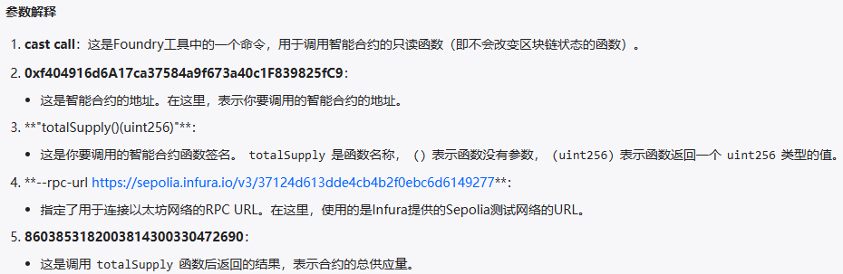
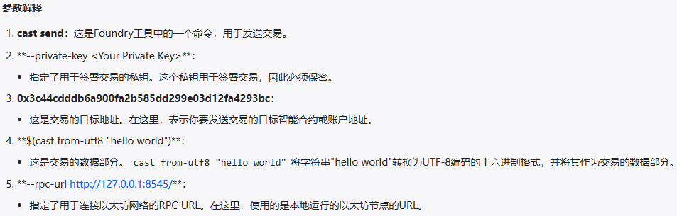

# Foundry
## 什么是Foundry
Foundry是一个solidity框架，用于构建、测试、模糊、调试和部署智能合
约。Foundry完全使用Solidity进行开发与测试，而且构建、测试的执行速
非常快。

Foundry通过cheatcodes来操纵区块链的状态，可以方便我们模拟各种情况。

Foundry用Rust语言编写，包含了一系列可以与Ethereum网络交互的工具
- Forge 用来进行合约的测试
- Cast 与合约进行交互，发交易，查询链上数据
- Anvil 可以模拟一个私有节点
- Chisel 可以在命令行快速的有效的实时的写合约、测试合约

## 安装Foundry
### 使用Foundryup安装
Foundryup是foundry工具包的安装器

1、终端执行，这会下载`foundryup`.（提示设置环境变量或者新开窗口，并通过运行它安装foundry）
```bash
curl -L https://foundry.paradigm.xyz | bash
```
2、执行后会自动安装,`forge`,`cast`,`anvil`,`chisel`

3、验证安装是否成功
```bash
forge --version
```
> Windows一般采用git bash内执行安装,因为目前Foundryup不支持Powershell

## 私钥的存储方式
1. 测试阶段可以使用键值对`$PRIVATE_KEY`存放在`.env`文件中,并保证`.env`文件包含在`.gitignore`中
2. 涉及到真实货币时可以采用`--interactive` 方式或者使用 [keystore file protected by a password](https://github.com/Cyfrin/foundry-full-course-f23?tab=readme-ov-file#can-you-encrypt-a-private-key---a-keystore-in-foundry-yet)
3. 使用 [thirdweb](https://thirdweb.com/)部署
```bash
forge script --help
# 指定一个加密文件存储路径，该文件由密码加密，这样私钥不会明文显示
forge script --keystore <PATH>

# 使用私钥导入钱包
cast wallet import <NAME> --interactive
cast wallet list
forge script script/DeploySimpleStorage.s.sol:DeploySimpleStorage --rpc-url 127.0.0.1:8545 --account defaultkey --sender 0xf39Fd6e51aad88F6F4ce6aB8827279cffFb92266 --broadcast -vvvv
```

## 交易
### 交易费计算
Total Cost = Gas Used * Gas Price

279,288.255846978 Gwei = 357,498 * 0.781230261 Gwei  => 0.000279288255846978 ETH
[例子](https://sepolia.etherscan.io/tx/0xc496b9d30df33aa9285ddd384c14ce2a58eef470898b5cda001d0f4a21b017f6)
### EVM和zksync交易类型
以太坊虚拟机（EVM）和ZKsync生态系统支持多种交易类型，以适应各种以太坊改提案(EIP)。最初，以太坊只有一种交易类型(`0x0`)，
但随着生态系统演变，通过各种EIP引入了多种类型。
- Legacy `0x0`：evm最初的交易类型
- EIP-2930 `0x1`：
- EIP-1559 `0x2`：当前EVM的默认类型。在以太坊伦敦升级中引入，EIP-1559：ETH 1.0 链费用市场变更，修改了交易费用的处理方式，用基础费用替换了 gasPrice ，并允许用户设置 maxPriorityFeePerGas 和 maxFeePerGas 。
- EIP-712 `0x71`：类型化结构化数据哈希和签名，允许在交易中实现结构化数据的哈希和签名。ZKsync Era 使用这项技术来实现账户抽象和代付主等功能。

[交易类型的区别、legacy、eip-1559、eip-2930、eip-4844](https://learnblockchain.cn/article/8858)

## Forge
### forge init初始化项目 
```bash
forge init hello_foundry
```
`init` 命令会自动创建一个项目目录,并安装好`forge-std`库
- scr:智能合约目录
- script:部署脚本文件
- lib:依赖库目录
- test:智能合约测试用例文件
- foundry.toml:配置文件

### forge build编译及 forge test测试
`forge build`编译合约，如果foundry.toml文件未指定solc编译版本，则默认使用最新的。编译好的文件(合约ABI，bytecode)，放在`out`文件夹中。

`forge test`命令执行测试用例，一键把所有`test`包下的测试用例都执行一边，并打印测试的结果。

一些约定:
- 测试用例位于`test`包下,通常用`***.t.sol`为结尾来命名
- 测试方法的命名`test_***`，后面遵循骆驼峰命名
- 继承`forge-std`标准库下的`Test.sol`合约来编写测试用例
```solidity
// SPDX-License-Identifier: UNLICENSED
pragma solidity ^0.8.13;

import {Test, console} from "forge-std/Test.sol";
import {Counter} from "../src/Counter.sol";

contract CounterTest is Test {
    Counter public counter;

    function setUp() public {//测试前的初始化
        counter = new Counter();
        counter.setNumber(0);
    }

    function test_Increment() public {
        counter.increment();
        assertEq(counter.number(), 1);//断言修改后的状态变量,assertNotEq断言不相等
    }

    function testFuzz_SetNumber(uint256 x) public {
        counter.setNumber(x);
        assertEq(counter.number(), x);
    }
}
```
执行测试的三种方式:
- `forge test` 一键执行
- `forge test --match-path test/Counter.t.sol`,使用`--match-path`指定某一路径下的文件
- `forge test --match-contract ConunterTest --match-test test_Increment`,用`--match-contract`来指定测试合约的名称

验证Revert:
- `testFail_xxx`来验证是否触发了revert操作，如果没有触发revert则测试失败，否则测试通过。
- `vm.expeectRevert(stdError.arithmericError)`来期望一个revert

`测试函数必须具有 external 或 public 可见性。声明为 internal 或 private 的函数不会被forge处理，即使它们的前缀为 test`

测试等级:
- -v 默认
- -vv 打印测试中的日志、断言、预期结果、错误原因
- -vvv 打印出测试失败中的失败堆栈调用
- -vvvv 显示最详细的测试结果，包括所有内部调用和日志信息
- -vvvvv

### forge create合约部署与验证
```bash
forge create --rpc-url https://sepolia.infura.io/v3/37124d613dde4cb4b2f0ebc6d6149277  
--private-key 7a53f0a5f517ecb17943179a7eb351227607ee7bb01c2ca9d1785ea4ade5f147 
--etherscan-api-key IC4N3ES8HC8CSGCDPUN3JIPGJY5KPPKZFN 
--verify src/MyContract.sol:MyToken --constructor-args asuna ASU 18 100000
```
- -verify: 验证合约，即在浏览器中开源合约的源码
- --private-key: 钱包私钥
- --constructor-args: 部署合约构造函数参数

验证合约:
1. forge verify-contract
```bash
forge verify-contract \
    --chain-id 11155111 \
    --num-of-optimizations 1000000 \
    --watch \
    --constructor-args $(cast abi-encode "constructor(string,string,uint256,uint256)" "ForgeUSD" "FUSD" 18 1000000000000000000000) \
    --etherscan-api-key <your_etherscan_api_key> \
    --compiler-version v0.8.10+commit.fc410830 \
    <the_contract_address> \
	    src/MyToken.sol:MyToken 
```

#### 脚本部署合约
```solidity
// SPDX-License-Identifier: UNLICENSED
pragma solidity ^0.8.25;

import {Script} from "forge-std/Script.sol";
import "../src/MyToken.sol";

contract MyTokenScript is Script {

    function run() external {
        uint256 deployer = vm.envUint("PRIVATE_KEY");

        vm.startBroadcast(deployer);
        
        MyToken myToken = new MyToken("MyToken", "MT", 18, 1000000000000000000);
        vm.stopBroadcast();
    }
}
```
```bash
forge script script/MyTokenScript.s.sol:MyTokenScript --broadcast --rpc-url <RPC_URL> --private-key <YOUR_PRIVATE_KEY>
```
- `vm.startBroadcast()`: 标记从这一点开始的所有交易都应该被广播。这意味着在`vm.startBroadcast()`和`vm.stopBroadcast()`之间的所有操作都会被记录并准备广播。
- `--broadcst`: 广播交易，执行实际部署操作广播到区块链网络。不加则只是模拟部署过程。

这个部署脚本本身就是一个智能合约。脚本是通过调用名为`run`的函数来执行的
## Cast
cast是foundry用于执行以太坊RPC调用的命令行工具。
```bash
cast <subcommand>
```
### 获取链上信息
1. 直接使用
```bash
cast call 0x6b175474e89094c44da98b954eedeac495271d0f "totalSupply()(uint256)" 
--rpc-url <your rpc url> 
8603853182003814300330472690
```

2. 设置--rpc-url
```bash
export ETH_RPC_URL="https://eth-mainnet.alchemyapi.io/v2/Lc7oIGYeL_......"
```
设置了RPC URL后，就不需要每次运行命令时单独设置
```bash
#获取链id
cast chain-id
#获取client
cast client
#链的名称
cast chain
#gas价格
cast gas-price
```
### 获取区块信息
```bash
#最新区块号 
cast block-number
# 获取指定区块的基础费用
cast basefee 6139522
#区块的时间戳
cast age
```
### 获取账户信息
```bash
#获取指定账户的金额,单位是 wei
cast balance <address>
#指定ENS名称查询余额
cast balance vitalik.eth
```

### 发送交易
调用合约函数

```bash
cast send --private-key <private_key_addr> <contract_addr> "exampleFunc(uint256)" <argument_value_of_the_function>
# 案例
cast send --private-key 0x7a53f0a5f517ecb17943179a7eb351227607ee7bb01c2ca9d1785ea4ade5f147 0xf404916d6A17ca37584a9f673a40c1F839825fC9 "balanceOf(address)" 0x3C2c4Cd3d0F7902FD72700D98fad2750746e03d6
```

如果调用合约中不存在的函数，将自动触发`Fallback`函数.这可以用于测试合约的异常处理或特定的功能。
```bash
cast send --private-key 0x123... 0xabc... "dummy()"
```

通过向合约发送以太币（Ether），可以触发合约的 Receive 函数。这对于接受捐款或处理支付非常有用。
```bash
cast send --private-key <private_key_addr> <contract_addr> --value 10gwei
```

### 获取合约代码
```bash
cast etherscan-source <contract-address>
# 案例
cast etherscan-source 0xf404916d6A17ca37584a9f673a40c1F839825fC9
```
### 获取链上Storage槽的private状态变量
```bash
cast storage 0x5FbDB2315678afecb367f032d93F642f64180aa3 1 --rpc-url http://localhost:8545
```
### 将bytes32转为string
```bash
cast parse-bytes32-string 0x6d696b617361000000000000000000000000000000000000000000000000000c
```
### 获取合约所有storage变量
```bash
forge inspect <contract_name> <option>
forge inspect PasswordStore storage
```
### 解析函数的返回值
```bash
# 1
cast abi-decode "name()(string)" \ 
0x000000000000000000000000000000000000000000000000000000000000002000000000000000000000000000000000000000000000000000000000000000084f7572546f6b656e000000000000000000000000000000000000000000000000

# 2
cast call 0x0165878A594ca255338adfa4d48449f69242Eb8F "balanceOf(address)" 0xf39Fd6e51aad88F6F4ce6aB8827279cffFb92266 | cast to-dec
```

## Anvil
Anvil是Foundry套件的一部分，专为提供一个便于本地测试和开发的以太坊节点而设计。Anvil与Forge、Cast、Chisel一起为智能合约开发者提供了一个完整的工具集，以支持从开发到测试的整个生命周期。

### Anvil的功能和重要性
Anvil允许开发者在本地环境中运行一个轻量级的以太坊节点，这使得从前端测试智能合约或通过RPC接口与合约进行交互变得简单快捷。

### 安装
运行 foundryup 来更新到最新版本，确保所有工具都是最新的

### 运行
```bash
# 运行
anvil
#查看帮助
anvil -h
#生成10个开发账户
anvil -a 10
#设置硬分叉版本
anvil --hardfork <HARDFORK>
#设置监听端口
anvil -p <PORT>
#创建从网络复制分叉在本地创建一个节点，从第500000个区块开始
anvil --fork-url https://sepolia.infura.io/v3/<YOUR_KEY> --fork-block-number 500000
```
## Chisel
Chisel 是一个 Solidity REPL（"读取-评估-打印 循环 "的缩写），它允许开发人员编写和测试 Solidity 代码片段。

启动 Chisel 非常简单，只需在命令行中输入 `chisel` 即可。启动后，你可以直接在命令行中编写和测试 Solidity 代码。

## Forge标准库
Forge Std的核心是其测试合约`Test.sol`

使用Forge Std，只需要导入Test.sol,并测试合约中继承Test:
```solidity
import "forge-std/Test.sol";

contract ContractTest is Test {
    // 测试代码
}
```
核心功能
- 访问`Hevm`:通过vm实例可以直接使用cheatcodes来模拟各种区块链状态和行为。
- 断言与日志记录
- 标准库各种实用工具

包含的库
- Std Logs 
- Std Assertions 对DSTest库中的断言函数进行了扩展
- Std Cheats 
- Std Error
- Std Storage
## 测试
### 作弊码(Cheatcode)
作弊码允许开发者在测试中执行一系列非标准操作，比如更改区块好、修改调用者身份等。
- 身份切换: vm.prank
- 预期还原: vm.expectRevert
- 事件验证：vm.expectEmit

### 编写测试
导入`forge-std/Test.sol`继承`Test`
```solidity
pragma solidity 0.8.10;

import "forge-std/Test.sol";

contract MyTest is Test {
    // 测试代码
}
```

`setUp` 是一个可选函数，会在每个测试用例运行前被调用，用于初始化测试环境

`test`为前缀被识别为测试用例

`testFail`为前缀的函数，测试预期失败，没有触发revert，则测试失败

### 执行测试
全局测试
```bash
forge test
```

指定测试
```bash
# 此命令将仅运行名为ComplicatedContractTest的测试合约中包含test_Deposit的测试函数。
forge test --match-contract ComplicatedContractTest --match-test test_Depsosit
```

Glob模式
```bash
forge test --match-path test/ContractB.t.sol
```

在分叉上测试
```bash
forge test --fork-url <RPC_URL>
```

观察模式
- `forge test --watch` 对文件更改时，forge可以重新运行测试
- `forge test --watch --run-all` 更改时，重新运行所有测试

### 执行后颜色标识
- 黄色：有触发 revert 的调用
- 红色：触发revert的调用
- 蓝色：对Cheatcodes的调用
- 青色：已发出的日志
- 黄色：合约部署

### 分叉测试
```bash
# 1
forge test --fork-url <your_rpc_url>
# 2
forge test --fork-url <your_rpc_url> --fork-block-number 1
# 3
forge test --fork-url <your_rpc_url> --etherscan-api-key <your_etherscan_api_key>
```
#### 三种分叉测试方式
- `vm.createFork()`：用于测试过程中动态创建分叉，适用于需要在测试中频繁切换分叉的场景。
- `anvil --fork-url`：用于启动本地节点并创建分叉，适用于本地环境的持续开发和测试。
- `forge test --fork-url`：用于在测试环境中创建分叉，并在该分叉上运行所有测试，适用于需要在分叉环境中进行全面测试的场景。

#### 分叉作弊码
分叉作弊码允许我们在solidity测试代码中直接创建、选择和管理多个分叉。每个奉茶通过一个唯一的`uint256`标识在识别。

*** 重要的是要记住，所有测试函数都是隔离的，这意味着每个测试函数都在setUp后的状态副本中执行，并在其自己的独立 EVM 中执行。因此，在setUp期间创建的分叉在测试中可用。**

#### 分叉的独立和持久性
每个分叉都是一个独立的`EVM`，使用完全独立的存储。`msg.sender`和测试合约本省的状态在分叉间时持久的。

持久性账户允许我们在一个分叉环境中创建和修改状态，并在另一个分叉环境中保持这些状态不变。
```solidity
contract SimpleStorageContract {
    uint256 public value;

    function set(uint256 _value) public {
        value = _value;
    }
}

// 创建并测试持久性合约
function testCreatePersistentContract() public {
    // 首先，选择一个分叉环境
    vm.selectFork(mainnetFork);
    // 在该分叉环境中部署并初始化合约
    SimpleStorageContract simple = new SimpleStorageContract();
    simple.set(100);
    // 确认合约的状态设置正确
    assertEq(simple.value(), 100);

    // 接下来，将合约标记为持久性
    vm.makePersistent(address(simple));
    // 验证合约已被正确标记为持久性
    assert(vm.isPersistent(address(simple)));

    // 然后，切换到另一个分叉环境
    vm.selectFork(optimismFork);
    // 验证即使在新的分叉环境中，合约仍被标记为持久性
    assert(vm.isPersistent(address(simple)));

    // 最后，确认持久性合约的状态在新的分叉环境中保持不变
    assertEq(simple.value(), 100);
}
```

### 模糊测试
#### 单元测试
```solidity
import "forge-std/Test.sol";

contract SafeTest is Test {
    Safe safe;

    function setUp() public {
        safe = new Safe();
    }

    function test_Withdraw() public {
        payable(address(safe)).transfer(1 ether);
        uint256 preBalance = address(this).balance;
        safe.withdraw();
        uint256 postBalance = address(this).balance;
        assertEq(preBalance + 1 ether, postBalance);
    }
}
```
#### 属性测试
在Foundry中，任何待用参数的测试函数都会被视为属性测试
```solidity
function testFuzz_Withdraw(uint256 amount) public {
    payable(address(safe)).transfer(amount);
    uint256 preBalance = address(this).balance;
    safe.withdraw();
    uint256 postBalance = address(this).balance;
    assertEq(preBalance + amount, postBalance);
}
```

#### 排除特定情况
使用`vm.assume`作弊码。可以排除某些不希望进行测试的特定情况。
```solidity
function testFuzz_Withdraw(uint96 amount) public {
    vm.assume(amount > 0.1 ether);
    // 测试逻辑...
}
```
#### Fuzz Testing优势
- 自动化测试
- 广泛的覆盖率
- 灵活性高

#### 单元测试,属性测试完整案例
```solidity
// SPDX-License-Identifier: MIT
pragma solidity ^0.8.22;
contract Safe{
    receive() external payable{}
    constructor() payable{}
    function withdraw() public{
        payable(msg.sender).transfer(address(this).balance);
    }
}

// SPDX-License-Identifier: MIT
pragma solidity ^0.8.22;
import "forge-std/Test.sol";
import "src/Safe.sol";
contract SafeTest is Test{
    Safe safe;
    function setUp() public{
        safe = new Safe();
    }
    receive() external payable{}

    //单元测试
    function test_Withdraw() public {
        payable(address(safe)).transfer(1 ether);//给合约转 1 ether
        uint256 preBalance = address(this).balance; 
        safe.withdraw();//取出合约中的所有金额给msg.sender
        uint256 postBalance = address(this).balance;//取出后合约的余额
        assertEq(preBalance + 1 ether, postBalance);
    }
    //属性测试
    //在进行 Fuzz Testing 时，可能会遇到高值输入导致测试失败的情况。
    //例如，当amount超过合约拥有的余额时，测试将失败。
    //为了解决这个问题，可以限制amount的类型为uint96，以确保输入值在合理的范围内。
    function testFuzz_Withdraw(uint96 amount) public{
        //amount必须大于0.1 ether
        vm.assume(amount > 0.1 ether);

        payable(address(safe)).transfer(amount);
        uint256 preBalance = address(this).balance;
        safe.withdraw();
        uint256 postBalance = address(this).balance;
        assertEq(preBalance + amount, postBalance);
    }
}
```
### 不变性测试
允许对预定义合约中预定义函数调用的随机序列进行测试，并在每次函数调用后断言一组不变表达式。

不变性的测试维度：
- 运行(runs)
- 深度(depth)

#### 不变量
不变量是在模糊测试过程中始终保持真实的条件表达式。一个好的不变性测试套件应尽可能多地包含不变量。

不变量例子：
- 对于Uniswap,"xy=k公式始终成立"。
- 对于ERC-20代币，"所有用户余额之和等于总供应量"。

### 差异化测试
差异测试是一种通过比较同一功能的多个实现的输出来找出错误的测试方法。

差异测试的核心是交叉验证。例如，如果我们有一个功能规范 F(X) 和该规范的两个实现 f1(X) 和 f2(X)，我们期望对于所有合理的输入 x，f1(x) 应该等于 f2(x)。如果 f1(x) 不等于 f2(x)，那么我们知道至少有一个实现是错误的。

差异测试特别适用于以下情况：
- 将升级后的实现与其早期版本进行比较。
- 对照已知的参考实现测试代码。
- 确认与第三方工具和依赖项的兼容性。

#### 差异化测试案例
```solidity
// Solidity 版本的默克尔树实现
function generateMerkleRoot(bytes32[] memory leaves) public pure returns (bytes32) {
    // 示例代码：具体实现细节省略
    return keccak256(abi.encodePacked(leaves));
}

function testMerkleRootMatchesJSImplementation(bytes32[] memory leaves) public {
    string[] memory args = new string[](3);
    args[0] = "node";
    args[1] = "./calculateMerkleRoot.js";
    args[2] = leaves.toHexString();  // 假设已实现转换为 hex 字符串的功能

    //vm.ffi 调用外部实现
    bytes memory jsResult = vm.ffi(args);
    bytes32 jsMerkleRoot = abi.decode(jsResult, (bytes32));

    bytes32 solMerkleRoot = generateMerkleRoot(leaves);
    assertEq(solMerkleRoot, jsMerkleRoot, "Merkle roots do not match");
}
```

## 模拟主网分叉
模拟主网分叉是指将一个活跃的区块链网络的状态复制到本地，并在本地环境中使用，通常 用于按照实际网络环境的状态来测试你的智能合约。

### 启动分叉
```bash
# 配置 RPC-URL
anvil --fork-url <YOUR_ENDPOINT_URL> --form-block-number 1900000
```
- `--fork-url` 标签用于从远端获取区块链状态
- `--fork-block-number` 用于从特定区块号开始分叉区块链状态

## 常见错误
1. OutOfFunds：在区块链和智能合约的上下文中，"OutOfFunds"（资金不足）是一个常见的错误或异常情况
2. PrecompileOOG：指在执行预编译合约（Precompiled Contracts）时遇到的"Out of Gas"（OOG）错误，交易提供的Gas不足以覆盖执行所需的全部Gas时
- transfer 转账有gas限制,而使用call方法没有
3. division or modulo by zero：如果你尝试进行除法或取模运算，并且除数为0，那么会触发一个运行时错误，导致交易被回滚

