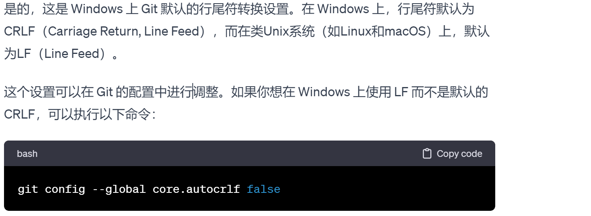

+++
author = "屑莹"
title = "hugo 踩坑记录"
date = 2024-01-24T03:16:00+08:00
description = ""
categories = [
    "编程",
]
tags = [
    "hugo",
]
image = "20230116234811.png"
+++
# githun action 
- Hugo 编译后生成的是xml问题一般是主题没加载上
- 主题如果采用submoudle 模式，在action配置文件需要加入加载主题子模块的代码
```shell
    cd you-repo-name 
    # 初始化子模块
    git submodule update --init --recursive
    git submodule update --recursive --remote
```

# Hugo编译后css文件加载不出,hugo server显示正常
[Hugo编译后与hugo server显示不一致](https://www.coder.work/article/7617383)
[stackoverflow](https://stackoverflow.com/questions/62114592/hugo-not-generating-the-same-styling-as-in-development-mode)

# windows换行问题
