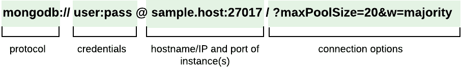

# mongodb
MongoDB是一种文档型数据库，它是为存储和检索大量数据而设计的。

use 名字,创建数据数据库，默认回先存放在内存中，如果有集合了才会创建到磁盘
## 使用场景
- 高并发
- 高效率存储（高性能）
- 高扩展和高可用
## 适用的数据结构
- 非结构化数据
- 文档数据
- 地图数据
- 聊天数据
- 日志数据
- 缓存数据

## 操作
网上优秀的参考:
1. https://gist.github.com/dollarkillerx/ecd4bdf66737175c78d9d0bc1643c1c0
2. https://wiki.eryajf.net/pages/7fea3f/#%E6%B7%BB%E5%8A%A0%E5%A4%9A%E6%9D%A1
3. <a href='https://www.mongodb.com/docs/drivers/go/current/fundamentals/connections/connection-guide/'>官方文档<a>

### 数据库连接

``` go
// bson.D 有序 表示文档 排序、投影、更新  
// bson.M 无序 map集合 查询、查询
// bson.E 键值对，可以用来构建bson.M
// bson.A 有序 表示数组
    func InitDb() *mongo.Client {
	uri := "mongodb://127.0.0.1:27017"
	//连接数据库
	client, err := mongo.Connect(context.Background(), options.Client().ApplyURI(uri))
	if err != nil {
		log.Fatal("client:", err)
	}

	// 判断服务是不是可用
	if err = client.Ping(context.Background(), readpref.Primary()); err != nil {
		log.Fatal("ping:", err)
	}
	/* 关闭连接
		defer func() {
			if err = client.Disconnect(context.TODO()); err != nil {
				log.Fatal("dis:", err)
			}
		}()
	*/
	return client

}

```

### 插入单条
```go
    func AddOne() {
	ctx := context.Background()
	//当数据库或者集合不存在时，会自动创建数据库与集合
	db := InitDb().Database("class")
	defer db.Client().Disconnect(ctx)

	table := db.Collection("user")
	doc := make(map[string]interface{})
	doc["id"] = 2
	doc["name"] = "mikasa2"
	//doc1 := bson.A{"bar", "world", 3.14159, bson.D{{"qux", 12345}}}
	_, err := table.InsertOne(ctx, doc)
	if err != nil {
		log.Fatal("插入失败:", err)
	}
	if err != nil {
		log.Fatal(err)
	}
}
```

### 插入多条
```go
    func AddMore() {
	ctx := context.Background()
	db := InitDb().Database("class")
	table := db.Collection("user")
	var doc = []interface{}{
		bson.D{{Key: "title", Value: "title1"}, {Key: "text", Value: "text1"}},
		bson.D{{Key: "title", Value: "title2"}, {Key: "text", Value: "text2"}},
	}
	r, err := table.InsertMany(ctx, doc)
	if err != nil {
		log.Fatal(err)
	}
	fmt.Println(r)

}
```
### 更新一条
```go
    func UpdateOne() {
	db := InitDb().Database("class")
	table := db.Collection("user")
	filter := bson.M{"title": "你好"}
	update := bson.D{{Key: "$set", Value: bson.D{{Key: "title", Value: "你好美女"}}}}

	//三个参数 context  filter要筛选的数据   update 要更新的数据
	r, err := table.UpdateOne(context.Background(), filter, update)
	if err != nil {
		log.Fatal(err)
	}
	fmt.Println(r)
}

```
### 更新多条
```go
    func UpdateMany() {
	db := InitDb().Database("class")
	table := db.Collection("testdata")

	filter := bson.D{{Key: "group_identify", Value: "test"}}

	//$mul 更新操作符,将age这列乘以2,  $set 也是更新数据,重新给一个值
	update := bson.D{{Key: "$mul", Value: bson.D{{Key: "age", Value: 2}}}}

	r, err := table.UpdateMany(context.Background(), filter, update)
	if err != nil {
		log.Fatal(err)
	}
	fmt.Println(r)
}
```

### 查询单条
```go
    // 查询单条
func FindOne() {
	db := InitDb().Database("class")
	table := db.Collection("testdata")
	var result bson.M
	err := table.FindOne(context.Background(), bson.M{"name": "小A"}).Decode(&result)
	if err != nil {
		log.Fatal(err)
	}
	//序列化成json  Encode 返回 val 的 JSON 编码
	v, err := encoder.Encode(result, encoder.SortMapKeys)
	if err != nil {
		log.Fatal(err)
	}
	fmt.Println(string(v))


	//利用id查询
	var result1 bson.M
	//用十六进制创建objectId
	objid, err := primitive.ObjectIDFromHex("65990f180b9dae893a119618")
	if err != nil {
		log.Fatal(err)
	}
	table.FindOne(context.Background(), bson.M{"_id": objid}).Decode(&result1)
	v1, err := encoder.Encode(result1, encoder.SortMapKeys)
	if err != nil {
		log.Fatal(err)
	}
	fmt.Println(string(v1))

}

```

### 用正则模糊查询
```go
    type Article struct {
	Title string
	Text  string
}

// 模糊查询
func FindAdLike() {
	db := InitDb().Database("class")
	table := db.Collection("user")

	findOptions := options.Find()
	filter := bson.D{}
	filter = append(filter, bson.E{
		Key:   "title",
		Value: bson.M{"$regex": primitive.Regex{Pattern: ".*" + "i" + ".", Options: "i"}}, //正则表达式模糊查询   i表示忽略大小写
	})
	cus, err := table.Find(context.TODO(), filter, findOptions)

    //关闭游标
	defer func(cus *mongo.Cursor, ctx context.Context) {
		err := cus.Close(ctx)
		if err != nil {
			return
		}
	}(cus, context.TODO())

	if err != nil {
		log.Fatal(err)
	}

	list := make([]*Article, 0)
	for cus.Next(context.TODO()) {
		article := new(Article)
		err := cus.Decode(&article)
		if err != nil {
			log.Fatal("decode failed:", err)
		}
		list = append(list, article)
	}

	fmt.Println(len(list))
}
```
### 查询多条
```go
func FindMany() {
	ctx := context.Background()
	db := InitDb().Database("class")
	table := db.Collection("testdata")
	cus, err := table.Find(ctx, bson.M{})

    //关闭游标
	defer func() {
		if err := cus.Close(ctx); err != nil {
			log.Fatal(err)
		}
	}()

	if err != nil {
		log.Fatal(err)
	}

	//第一种查询方法
	var list []bson.M
	err = cus.All(ctx, &list)
	if err != nil {
		log.Fatal(err)
	}
	fmt.Println(len(list))
	for _, v := range list {
		temp, err := encoder.Encode(v, encoder.SortMapKeys) //转为Json字符串
		if err != nil {
			log.Fatal(err)
		}
		fmt.Println(string(temp))
	}

	//第二种

	cus1, err := table.Find(ctx, bson.M{})
	if err != nil {
		log.Fatal(err)
	}
	var list1 []bson.M
	for cus1.Next(ctx) {
		var t bson.M
		err := cus1.Decode(&t)
		if err != nil {
			log.Fatal(err)
		}
		list1 = append(list1, t)
	}
	fmt.Println(list1)
}
```
### 获取总数
```go
    func GetAllCount() {
	db := InitDb().Database("class")
	table := db.Collection("testdata")
	count, err := table.CountDocuments(context.Background(), bson.D{})
	if err != nil {
		log.Fatal(err)
	}
	fmt.Println("总条数为：", count)
}
```
### 替换一条
```go
    func ReplaceOne() {
	db := InitDb().Database("class")
	table := db.Collection("testdata")
	filter := bson.M{"name": "大F"}
	replace := bson.D{{"name", "大大F"}, {"identify", "fff"}, {"age", 100}, {"group_identify", "test"}}

	result, err := table.ReplaceOne(context.Background(), filter, replace)
	if err != nil {
		log.Fatal(err)
	}
	fmt.Println(result)
}
```

### 删除单条
```go
    func DeleteOne() {
	table := InitDb().Database("class").Collection("testdata")
	filter := bson.M{"name": "大大F"}
	r, err := table.DeleteOne(context.Background(), filter)
	if err != nil {
		log.Fatal(err)
	}
	fmt.Println(r)

}
```
### 删除多条
```go
    func DeleteMany() {
	table := InitDb().Database("class").Collection("testdata")

	//有序  在一些特殊情况下，比如确保键值对的顺序对于查询的匹配是重要的

	//filter := bson.D{{Key: "age", Value: bson.D{{Key: "$gt", Value: 3}}}}//同样可以查
	filter := bson.M{"age": bson.M{"$gte": 5}} //无序
	r, err := table.DeleteMany(context.Background(), filter)
	if err != nil {
		log.Fatal(err)
	}
	fmt.Println(r)
}
```

### 汇总
```go
    func Count() {
	coll := InitDb().Database("class").Collection("testdata")
	filter := bson.D{{"group_identify", "test"}}

	//EstimatedDocumentCount() 获得集合中 文档数量的近似值
	estCount, estCountErr := coll.EstimatedDocumentCount(context.TODO())
	if estCountErr != nil {
		panic(estCountErr)
	}

	//获得集合中 文档的确切数量
	count, err := coll.CountDocuments(context.TODO(), filter)
	if err != nil {
		panic(err)
	}
	fmt.Println(estCount, count)
}
```
### 添加字段
```go
func UpdateOneField() {
	table := InitDb().Database("class").Collection("testdata")
	objid, err := primitive.ObjectIDFromHex("659955050b9dae893a11961c")
	if err != nil {
		log.Fatal(err)
	}
	filter := bson.M{"_id": objid}

	//添加字段 $push $push有一个问题就是，如果一个值重复往一个数组里添加  $addToSet数据重复不会再添加
	updateData := bson.M{"$addToSet": bson.M{"link_data": bson.M{"field_identify": "1", "model_data_id": "5"}}}
	r, err := table.UpdateOne(context.TODO(), filter, updateData)
	if err != nil {
		log.Fatal(err)
	}
	fmt.Println(r)
}
```
### 删除一个字段中的数据
```go
func DeleteOneFieldData() {
	table := InitDb().Database("class").Collection("testdata")
	objid, err := primitive.ObjectIDFromHex("659955050b9dae893a11961c")
	if err != nil {
		log.Fatal(err)
	}
	filter := bson.M{"_id": objid}
	updateData := bson.M{"$pull": bson.M{"link_data": bson.M{"field_identify": "1", "model_data_id": "5"}}}

	r, err := table.UpdateOne(context.Background(), filter, updateData)
	if err != nil {
		log.Fatal(err)
	}
	fmt.Println(r)
}
```
### 删除字段和数据
```go
func DeleteOneField() {
	table := InitDb().Database("class").Collection("testdata")
	objid, err := primitive.ObjectIDFromHex("659955050b9dae893a11961c")
	if err != nil {
		log.Fatal(err)
	}
	filter := bson.M{"_id": objid}
	updateData := bson.M{"$unset": bson.M{"link_data": ""}}
	r, err := table.UpdateOne(context.Background(), filter, updateData)
	if err != nil {
		log.Fatal(err)
	}
	fmt.Println(r)
}

```


