## 介绍
redis默认安装了命令行工具
``` bash
    redis-cli
```
查看对应数据类型的帮助文档
```bash
    #查看通用的命令
    help @generic

    help @string
    help @hash
    help @list
    help @set

    #查看命令
    help KEYS
    help SADD
    ...
```
## Redis通用命令
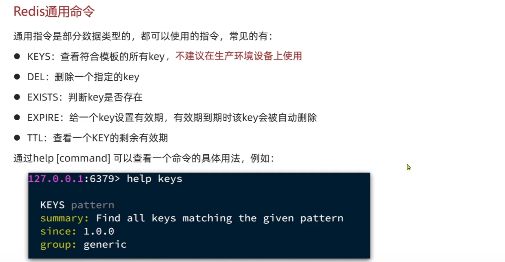
通用命令是不分数据类型的，都可以使用的命令。通过help [command]可以查看命令的具体用法
``` bash
    #KEYS:查看符合模版的所有Key
    KEYS *
    #DEL:删除一个指定的key
    DEL name
    #EXIST:判断key是否存在
    EXISTS name 
    #EXPIRE:给一个key设置有效期,有效期到期时该key会被自动删除
    EXPIRE name 10
    #TTL:查看一个key的剩余有效期
    TTL name
```

## String类型
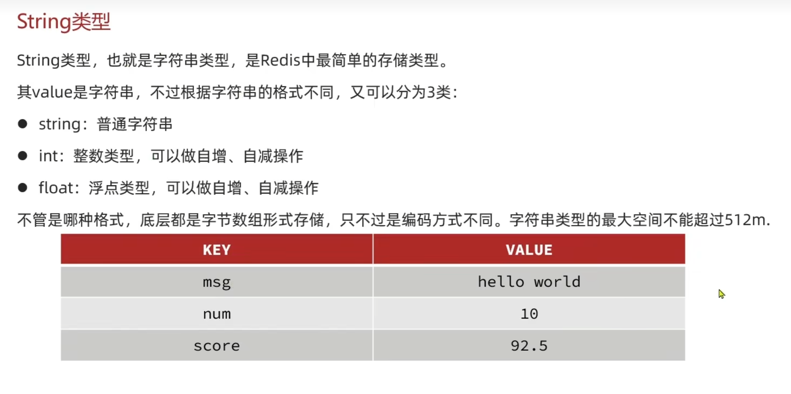
### String类型常见命令
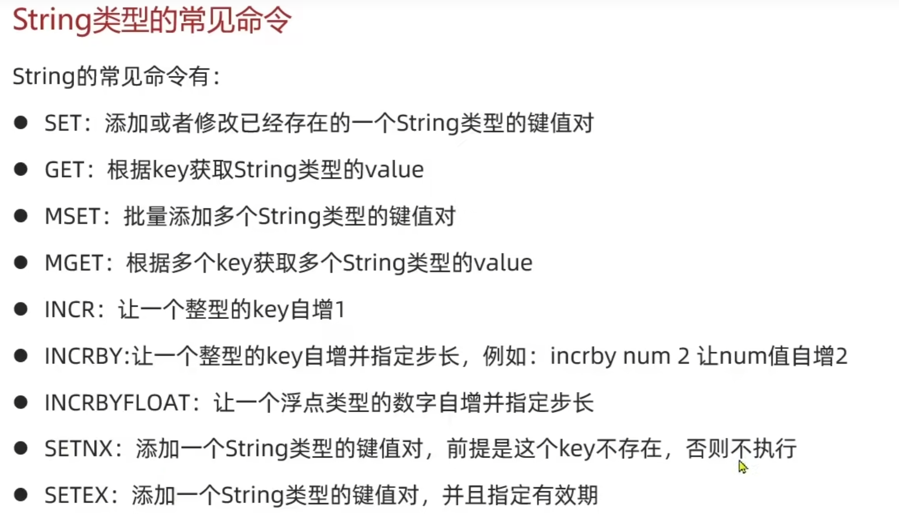
``` bash
  #设置键name值为lisi
  SET name lisi
  #获取键的值
  GET name
  #删除
  DEL name
  #查看所有键
  KEY *
  #自增key的值
  INCR age

```
### Key的结构
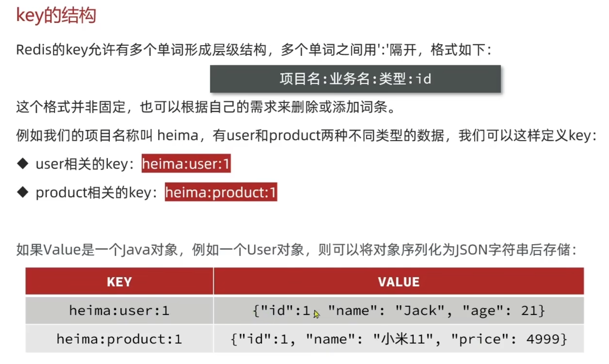
```bash
  SET heima:user:1 name jack
  SET heima:user:1 age 12
```

## Hash类型
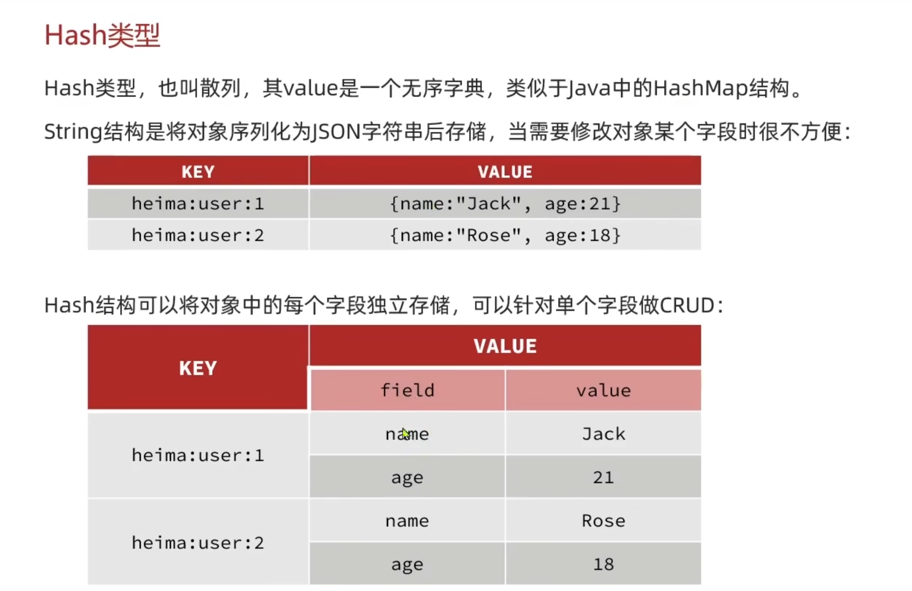
### Hash类型常见命令
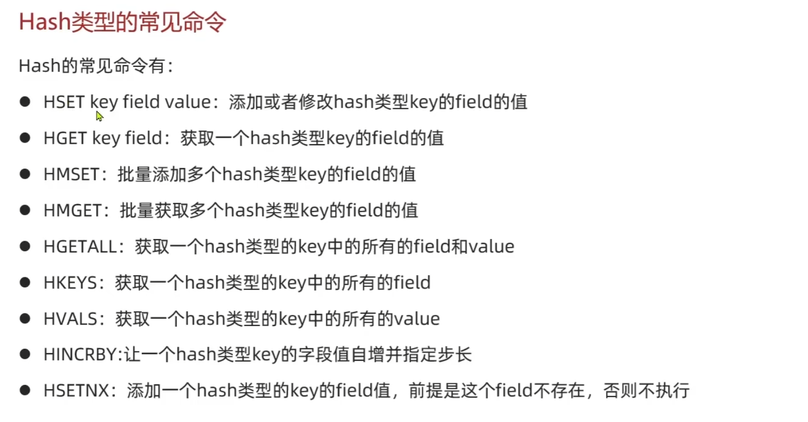
```bash
  HSET heima:user:1 name jack
  HGET heima:user:1
  #设置多个值
  HMSET heima:user:2 name lisi age 12
  #获取多个值
  HMGET heima:user:2 name age
  HKEYS heima:user:2
  #删除
  HDEL heima:user:1
```
## List类型
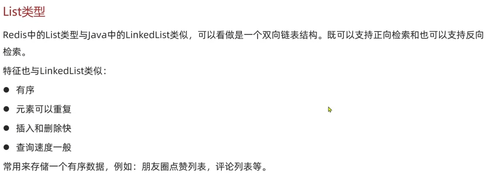
### List类型常见命令
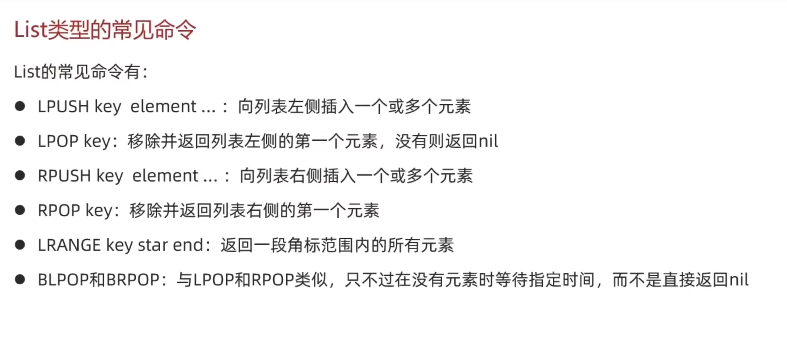
``` shell
  #插入多个值
  LPUSH  heima:list:1 v1 v2 v3 v4
  #从右边取出一个值并清除缓存的数据
  RPOP heima:list:1
  #等待指定时间取值
  BLPOP heima:list:1 10
```
## Set类型
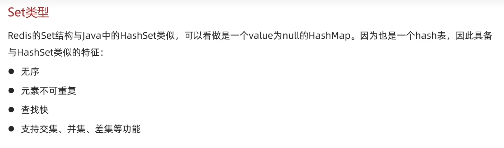
### Set类型常见命令
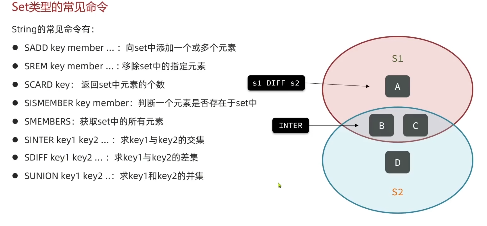
```bash
  SADD s1 v1 v2 v3
  SREM s1 v1
  SCARD s1
  SMEMBERS S1
```
## SortedSet类型
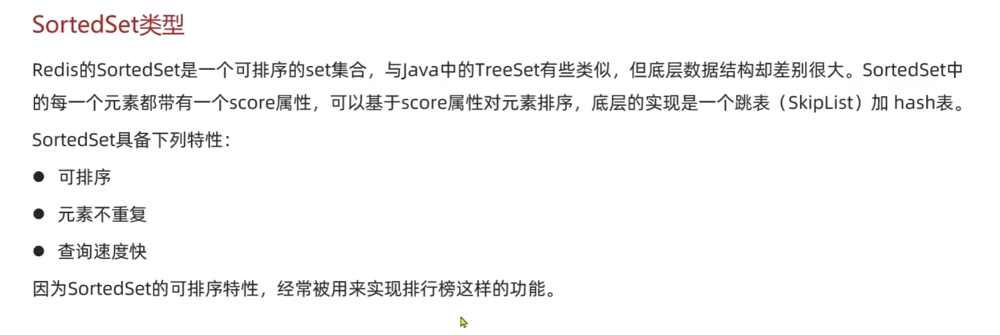

### SortedSet类型的常见命令
- 倒序
```bash
  ZADD stus 85 jack 89 lucy 82 rose 95 tom 78 jerry 92 amy 76 miles
  ZREM tom
  ZREVRANGE stus 0 2
  ZCOUNT stus 0 80
  ZINCRBY stus 1 jack
  ZRANGE stus 0 2
```
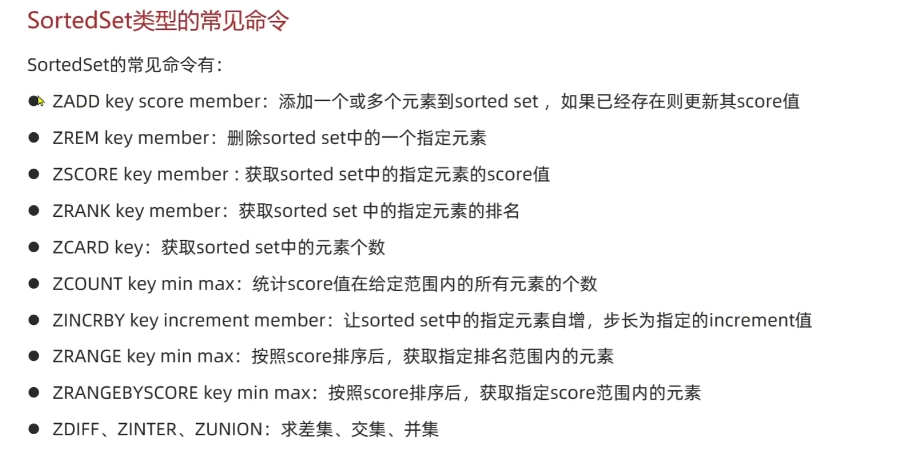

## 持久化
### AOF(append-only file)
用于将redis服务器接收到的写命令追加的文件末尾。AOF是一个文本文件，包含了Redis服务器接收到的写序列，
以及这些命令所产生的数据变更。
- 追加写入：AOF文件采用追加写入的方式记录命令，不会覆盖原有数据，因此更加安全，可以避免数据丢失。
- 可读性
- 部分恢复：可以根据需要选择部分恢复，而不是向RDB文件那样只能进行全量恢复。
- 实时性：实时记录Redis服务器接收的写命令，因此可以实现比RDB更精确的持久化。

使用方式
```text
AOF 持久化方式可以通过配置文件中的appendonly参数进行开启和关闭，默认情况下是关闭的。
当开启 AOF 持久化后，Redis 服务器会在接收到写命令后将命令追加到 AOF 文件末尾，以保
证数据持久化。在启动 Redis 服务器时，如果存在 AOF 文件，则会根据文件内容重建数据。
同时，Redis 服务器会定期对AOF 文件进行重写，以减少文件大小和提高读写效率。
```
### RDB
用于将Redis内存中的数据以快照的形式保存到硬盘上的二进制文件。RDB文件包含了Redis在某个时间点的数据快照。
- 全量备份
- 恢复时间较长

使用方式
```text
RDB 持久化方式可以通过配置文件中的 save 参数进行启用和设置备份策略。同时，Redis 服务器还提供了 
SAVE 和 BGSAVE 命令用于手动触发备份操作，其中 SAVE 命令会阻塞 Redis 服务器的其他操作直到备份
完成，而 BGSAVE 命令会在后台进行备份，不会阻塞其他操作。
````
## 集群
### 主从复制
Redis 的主从复制（Master-Slave Replication）是一种数据复制机制，用于将一个 Redis 实例（主节点）的
数据复制到多个其他 Redis 实例（从节点）上，从而实现数据的备份、读写分离和提高系统的可用性。
- 主从复制是异步的，即主节点执行写操作后，并不会立即通知从节点进行同步，而是在稍后的某个时间点进行同步。

1. 数据备份和容灾
2. 读写分离：主节点负责处理写操作，而从节点可以处理读操作
3. 扩展性
4. 实时数据分析：可以通过节点进行实时数据分析，而不影响主节点的性能

### 哨兵
Redis 哨兵（Sentinel）是一种用于监控和管理 Redis 主从复制集群的组件，它负责监控 Redis 服务器的健康状态，
并在主节点发生故障时自动进行故障转移，以确保系统的高可用性和可靠性。哨兵通常以独立的进程运行，与 Redis 服
务器分开部署，可以部署多个哨兵构成哨兵集群。

1. 监控： 哨兵定期向 Redis 服务器发送 PING 命令检查服务器的健康状态，包括主节点和从节点。如果主节点或从
节点无法响应哨兵的请求，哨兵会将该节点标记为不可用。

2.故障检测： 哨兵会根据配置文件中设置的主从关系和监控频率来监测 Redis 服务器的健康状态。当主节点不可用时，
哨兵会尝试选举一个新的主节点，并将从节点切换到新的主节点上。

3.故障转移： 当主节点发生故障时，哨兵会自动进行故障转移操作，选择一个从节点作为新的主节点，并通知其他从节
点切换到新的主节点上。故障转移过程中可以保证系统的持续可用性和数据一致性。

## Cluster
Redis Cluster 是 Redis 提供的一种分布式部署方式，用于将多个 Redis 节点组成一个集群，实现数据的分片存储
和高可用性。

1.分片存储： Redis Cluster 将数据分成多个片段（slot），每个片段被分配到集群中的不同节点上进行存储。通过
分片存储可以实现数据的水平扩展，提高了系统的吞吐量和存储容量。

2.高可用性：当主节点发生故障时可以自动进行故障转移，选举一个从节点作为新的主节点，保证了系统的持续可用性。

3.自动化管理：自动的节点发现和配置管理，当新的节点加入集群或者节点发生故障时，集群会自动进行节点的重新配
置和重新分配数据。

4.内部通信：使用内部通信协议进行节点之间的通信，保证了通信的安全性和可靠性，同时也提高了通信的效率。

5.数据一致性：Redis Cluster 使用基于哈希槽的分片机制来保证数据的一致性，每个键值对都会被映射到一个特定
的哈希槽上进行存储，同一个哈希槽的数据被存储在集群中的同一个节点上。

6.负载均衡： Redis Cluster 支持客户端的智能路由，根据键的哈希值将请求路由到相应的节点上进行处理，实现了
负载均衡和数据的均匀分布。

## 过期删除
- 定时删除(TTL)：对每个键值设置过期时间，当键值对的过期时间到达时，执行自动删除。

- 惰性删除：客服端尝试读取一个已经过期的键值对时，Redis会检查过期时间，如果过期则将其删除，并返回空值给客服端。

- 定期删除：Redis会周期性(默认每秒检查10次)的随机选择一些过期键值对进行检查各删除。(Redis 中的过期删除是以键
值对为单位进行的，而不是以字段或集合为单位。当键值对被删除时，如果这个键是一个哈希表的字段，那么哈希表中的字段
也会被删除。如果键是一个集合或列表，那么集合或列表也会被删除)

## 缓存穿透
Redis 缓存穿透是指恶意用户请求一个不存在于缓存和数据库中的数据，导致每次请求都直接访问数据库，从而给数据库带来巨
大的压力。为了避免缓存穿透，可以在查询数据库之前进行一些判断，比如使用布隆过滤器或者设置一个空值缓存。

使用布隆过滤器来判断请求的键是否合法，如果不合法则直接返回空值，避免访问数据库：

``` go
package main

import (
	"fmt"
	"github.com/willf/bloom"
	"sync"
)

var (
	cache       = make(map[string]string)
	cacheMutex  sync.RWMutex
	filter      *bloom.BloomFilter
	filterMutex sync.Mutex
)

func init() {
	// 初始化布隆过滤器
	filterMutex.Lock()
	filter = bloom.New(1000000, 5)
	filterMutex.Unlock()
}

func main() {
	// 模拟缓存数据
	cache["key1"] = "value1"
	cache["key2"] = "value2"
	cache["key3"] = "value3"

	// 模拟数据库查询函数
	dbQuery := func(key string) string {
		fmt.Println("Querying database for key:", key)
		// 此处应该是真正的数据库查询操作
		return "value from database"
	}

	// 查询函数包装，用于缓存穿透检测
	queryWithCache := func(key string) string {
		cacheMutex.RLock()
		value, ok := cache[key]
		cacheMutex.RUnlock()

		// 检查缓存中是否存在该键
		if ok {
			return value
		}

		// 检查布隆过滤器是否存在该键
		filterMutex.Lock()
		exists := filter.Test([]byte(key))
		filterMutex.Unlock()
		if !exists {
			// 如果布隆过滤器中不存在该键，直接返回空值
			return ""
		}

		// 查询数据库
		value = dbQuery(key)

		// 将查询结果放入缓存
		cacheMutex.Lock()
		cache[key] = value
		cacheMutex.Unlock()

		return value
	}

	// 测试查询函数
	key := "key4" // 不存在于缓存和数据库中的键
	value := queryWithCache(key)
	if value == "" {
		fmt.Println("Key", key, "not found")
	} else {
		fmt.Println("Value for key", key, "is", value)
	}
}

```

## 缓存雪崩
Redis 缓存雪崩是指在某个时间点，大量的缓存同时失效，导致大量的请求直接访问数据库，给数据库带来了巨大的压力，
甚至导致数据库崩溃。

采取策略：

1.缓存失效时间随机化：设置缓存失效时间时，可以加入一个随机因子，使得缓存失效时间在一个时间范围内随机分布，
避免大量缓存同时失效。

2.缓存预加载：提前异步加载缓存数据，确保缓存数据的及时更新

3.限流和熔断：请求进行限流和熔断，控制并发请求的数量，避免大量请求同时访问数据库。可以使用一些开源的限流组
件，比如 github.com/uber-go/ratelimit。

4.多级缓存:本地缓存（内存）、分布式缓存（Redis）、CDN 缓存

案例设置缓存失效时间的随机因子来避免缓存雪崩
```go
package main

import (
	"fmt"
	"math/rand"
	"sync"
	"time"
)

var (
	cache      = make(map[string]string)
	cacheMutex sync.RWMutex
)

func init() {
	rand.Seed(time.Now().UnixNano())
}

func main() {
	// 模拟缓存数据
	cache["key1"] = "value1"
	cache["key2"] = "value2"
	cache["key3"] = "value3"

	// 查询函数
	queryWithCache := func(key string) string {
		cacheMutex.RLock()
		value, ok := cache[key]
		cacheMutex.RUnlock()
		if ok {
			return value
		}

		// 模拟数据库查询函数
		dbQuery := func(key string) string {
			fmt.Println("Querying database for key:", key)
			// 此处应该是真正的数据库查询操作
			return "value from database"
		}

		// 查询数据库
		value = dbQuery(key)

		// 将查询结果放入缓存，并设置随机的失效时间
		cacheMutex.Lock()
		cache[key] = value
		cacheMutex.Unlock()

		// 设置缓存失效时间，范围为 5-10 分钟
		expire := time.Duration(rand.Intn(300)+300) * time.Second
		time.AfterFunc(expire, func() {
			cacheMutex.Lock()
			delete(cache, key)
			cacheMutex.Unlock()
			fmt.Println("Cache for key", key, "expired")
		})

		return value
	}

	// 模拟并发请求
	for i := 0; i < 10; i++ {
		go func(index int) {
			key := fmt.Sprintf("key%d", index)
			value := queryWithCache(key)
			fmt.Println("Value for key", key, "is", value)
		}(i)
	}

	// 等待所有请求完成
	time.Sleep(2 * time.Second)
}

```

## 缓存一致性
1.写后更新（Write-Through）：数据写入缓存之前先更新数据库

2.读写时更新（Read-Through）：数据读取时先检查缓存，如果缓存中存在则直接返回缓存数据，否则从数据
库中读取数据并更新缓存

3.写后刷新（Write-Behind）:数据写入数据库后异步更新缓存，即先更新数据库，再异步更新缓存。

4.双写一致性（Dual Writing）：数据写入数据库后同时更新缓存，然后返回结果

## 缓存击穿
Redis 缓存击穿是指某个热点数据突然失效或者缓存中不存在，导致大量的请求直接访问数据库，给数据库带
来了巨大的压力。

采取措施:
- 使用互斥锁：当缓存失效时，只允许一个请求访问数据库，其他请求等待该请求完成后再从缓存中获取数据。
可以使用 Go 语言的 sync.Mutex 来实现互斥锁。
- 使用分布式锁：使用分布式锁来确保只有一个请求访问数据库，其他请求等待锁释放后再从缓存中获取数据。
- 提前异步加载缓存数据

使用互斥锁
```go
package main

import (
	"fmt"
	"sync"
	"time"
)

var (
	cache      = make(map[string]string)
	cacheMutex sync.Mutex
)

func main() {
	// 模拟缓存数据
	cache["key1"] = "value1"
	cache["key2"] = "value2"
	cache["key3"] = "value3"

	// 查询函数
	queryWithCache := func(key string) string {
		cacheMutex.Lock()
		defer cacheMutex.Unlock()

		// 检查缓存中是否存在该键
		value, ok := cache[key]
		if ok {
			return value
		}

		// 模拟数据库查询函数
		dbQuery := func(key string) string {
			fmt.Println("Querying database for key:", key)
			// 此处应该是真正的数据库查询操作
			return "value from database"
		}

		// 查询数据库
		value = dbQuery(key)

		// 将查询结果放入缓存
		cache[key] = value

		return value
	}

	// 模拟并发请求
	for i := 0; i < 10; i++ {
		go func(index int) {
			key := fmt.Sprintf("key%d", index)
			value := queryWithCache(key)
			fmt.Println("Value for key", key, "is", value)
		}(i)
	}

	// 等待所有请求完成
	time.Sleep(2 * time.Second)
}

```
使用分布式锁
```go
package main

import (
	"context"
	"fmt"
	"github.com/go-redis/redis/v8"
	"time"
)

func acquireLock(client *redis.Client, lockKey string, expiration time.Duration) bool {
	ctx := context.Background()
	// 设置分布式锁，当且仅当 lockKey 不存在时设置成功
	ok, err := client.SetNX(ctx, lockKey, true, expiration).Result()
	if err != nil {
		fmt.Println("Failed to acquire lock:", err)
		return false
	}
	return ok
}

func releaseLock(client *redis.Client, lockKey string) bool {
	ctx := context.Background()
	// 删除分布式锁
	_, err := client.Del(ctx, lockKey).Result()
	if err != nil {
		fmt.Println("Failed to release lock:", err)
		return false
	}
	return true
}

func main() {
	// 初始化 Redis 客户端
	client := redis.NewClient(&redis.Options{
		Addr:     "localhost:6379",
		Password: "", // set your password
		DB:       0,  // use default DB
	})

	// 设置锁键和过期时间
	lockKey := "my_lock"
	expiration := 5 * time.Second

	// 尝试获取分布式锁
	if acquireLock(client, lockKey, expiration) {
		defer releaseLock(client, lockKey)
		fmt.Println("Lock acquired, do something...")
		// 在锁内执行需要保护的代码
	} else {
		fmt.Println("Failed to acquire lock, another process is holding it")
	}
}

```
## 分布式事务
分布式事务指的是在 Redis 中执行的一组命令，这些命令要么全部执行成功，要么全部执行
失败，类似于数据库中的事务。Redis 使用 MULTI 和 EXEC 命令来实现分布式事务。
- MULTI 命令用于开启一个事务
- EXEC 命令用于执行事务队列中的命令
- DISCARD 命令用于取消事务
```bash
127.0.0.1:6379> MULTI
OK
127.0.0.1:6379> SET key1 value1
QUEUED
127.0.0.1:6379> SET key2 value2
QUEUED
127.0.0.1:6379> SET key3 value3
QUEUED
127.0.0.1:6379> EXEC
1) OK
2) OK
3) OK

```

使用go实现
```go
/*
*在分布式事务中，并不能保证原子性，因此在实际应用中需要根据业务需求来决定是
*否使用分布式事务。如果需要保证原子性，可以考虑使用 Redis 的 WATCH 命令来实
*现乐观锁，或者使用分布式锁来保护关键操作。
*/
package main

import (
	"context"
	"fmt"
	"github.com/go-redis/redis/v8"
)

func main() {
	// 创建 Redis 客户端
	client := redis.NewClient(&redis.Options{
		Addr:     "localhost:6379",
		Password: "", // set your password
		DB:       0,  // use default DB
	})

	// 开启事务
	ctx := context.Background()
	tx := client.TxPipeline()

	// 将要执行的命令添加到事务队列中
	tx.Set(ctx, "key1", "value1", 0)
	tx.Set(ctx, "key2", "value2", 0)
	tx.Set(ctx, "key3", "value3", 0)

	// 执行事务
	_, err := tx.Exec(ctx)
	if err != nil {
		fmt.Println("Failed to execute transaction:", err)
		return
	}

	fmt.Println("Transaction executed successfully")
}
```