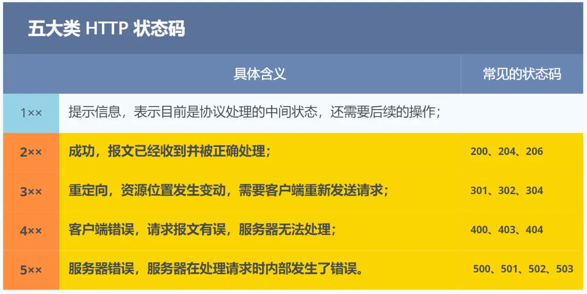

## 网络分层
常见的网络模型分为OSI七层模型与TCP/IP四层模型，OSI因为比较复杂实现起来麻烦，使用的不多。通常用TCP/IP
的四层网络模型。
### OSI模型
- 应用层
- 表示层
- 会话层
- 传输层
- 网络层
- 数据链路层
- 物理层
### TCP/IP模型
- 应用层：HTTP  FTP GRPC 
- 传输层：TCP UDP
- 网络层：IP
- 网络接口层

### 数据包封包解包流程

## 什么是HTTP
超文本传输协议,是网络中最常见的通讯协议。基于传输层TCP协议构建的应用层协议，数据采用明文传输，安全性差。

### Get 与 Post
「幂等」，意思是多次执行相同的操作，结果都是「相同」的。

「安全」是指请求方法不会「破坏」服务器上的资源。

GET:从服务器获取指定的资源，这个资源可以是静态的文本、页面、图片视频等。浏览器对URL的请求长度有限制，HTTP没有。所有来说GET请求是用长度限制的。GET请求是安全幂等的。

POST:新增或提交数据。因为会修改服务器上的资源所以是不安全的，因为会多次提交数据所以是不幂等的。
### HTTP 常见的状态码

### HTTP通过什么解决粘包问题的
HTTP 协议通过设置回车符、换行符作为 HTTP header 的边界，通过 Content-Length 字段作为 HTTP body 的边界，这两个方式都是为了解决“粘包”的问题。
### HTTP和HTTPS有什么区别
- HTTP是超文本传输协议，信息是明文传输的，存在安全问题。HTTPS则解决HTTP不安全的问题，在TCP和HTTP网络层之间加入SSL/TLS安全协议，是得报文能够加密传输。
- HTTP连接建立相对简单，TCP三次握手后便可进行HTTP的报文传输。而HTTPS在TCP三次握手后还需进行SSL/TLS的握手过程，才可进行加密报文传输。
- 两者端口不一样HTTP是80端口，HTTP是443端口。
- HTTPS协议需要向CA(证书权威结构)申请数字证书，来保证服务器的身份是可靠的。

### HTTPS解决了什么问题
- 窃听风险
- 篡改风险
- 冒充风险
### HTTP/2改进在哪
队头堵塞：
HTTP/2 是基于 TCP 协议来传输数据的，TCP 是字节流协议，TCP 层必须保证收到的字节数据是完整且连续的，这样内核才会将缓冲区里的数据返回给 HTTP 应用，那么当「前 1 个字节数据」没有到达时，后收到的字节数据只能存放在内核缓冲区里，只有等到这 1 个字节数据到达时，HTTP/2 应用层才能从内核中拿到数据，这就是 HTTP/2 队头阻塞问题。

- 兼容HTTP/1.1
- 使用HPACK 算法压缩请求头
- 为高频出现在头部的字符串和字段建立了一张静态表
- 将 HTTP/1 的文本格式改成二进制格式传输数据
- 多个 Stream 复用一条 TCP 连接，达到并发的效果，解决了 HTTP/1.1 队头阻塞的问题，提高了 HTTP 传输的吞吐量。
缺陷
- 队头阻塞
- TCP 与 TLS 的握手时延迟
- 网络迁移需要重新连接
### HTTP/3
将TCP协议改成了UDP,并在UDP上开发了QUIC协议来保障数据传输的可靠性
- 无队头堵塞
- 建立连接速度更快
- 
### 输入网址到展示发什么了
1. 解析URL地址生成HTTP请求报文
2. 进行DNS域名解析获取IP。先查看缓存如果有就直接返回
没有再去hosts文件查看，如果再没没有则发送DNS请求询问本地的DNS服务器
3. DNS获取到Ip后，就可以把HTTP协议的传输工作交给操作系统的协议栈
（HTTP是基于TCP协议传输数据前，要先进行TCP三次握手）
4. TCP 模块在执行连接、收发、断开等各阶段操作时，都需要委托 IP 模块
将数据封装成网络包发送给通信
5. 查找mac地址，先查路由表，如果路由表没有就通过ARP协议广播查找mac地址
6. 将数据包通过网卡发送到交换机，交换机再发送到服务器
## 什么是TCP
TCP是面向连接的、可靠的、基于字节流的传输层通信协议

TCP数据格式:

### TCP的三次握手和四次挥手
`TCP三次握手中，只有第三次握手是可以携带数据的，前两次握手是不可以携带数据的`

1. 第一次握手丢失了，会发生什么

客户端迟迟收不到服务端的 SYN-ACK 报文（第二次握手），就会触发「超时重传」机制，重传 SYN 报文，而且重传的 SYN 报文的序列号都是一样的。每次超时的时间是上一次的 2 倍。

2. 第二次握手丢失了

客户端和服务端都会重传

3. 服务端那一方迟迟收不到这个ACK确认报文，就会触发超时重传机制
`(ACK 报文是不会有重传的，当 ACK 丢失了，就由对方重传对应的报文)`
### 为什么挥手需要四次？
- 关闭连接时，客户端向服务端发送 FIN 时，仅仅表示客户端不再发送数据了但是还能接收数据。  
- 服务端收到客户端的 FIN 报文时，先回一个 ACK 应答报文，而服务端可能还有数据需要处理和发送，等服务端不再发送数据时，才发送 FIN 报文给客户端来表示同意现在关闭连接。
1. 第一次挥手丢失

客户端迟迟收不到被动方的 ACK 的话,触发客户端重传FIN

2. 第二挥手丢失

服务端的第二次挥手丢失了，客户端就会触发超时重传机制,重传 FIN 报文

3. 第三次挥手丢失

服务端就会重发 FIN 报文

4. 第四次挥手丢失

客户收到FIN报文消息后，回复ACK确认消息。回复的ACK未到达服务器，服务端就会重发 FIN 报文。

## 什么是UDP
UDP 不提供复杂的控制机制，利用 IP 提供面向「无连接」的通信服务。DNS采用UDP协议

UDP的数据格式：

### TCP和UDP的区别
1. 连接
- TCP是面向连接的传输层协议，传输数据前要先建立连接
- UDP是不需要连接，即刻传输数据
2. 服务对象
- TCP是一对一的两点服务，即一条连接只有两个端点
- UDP支持一对一、一对多、多对多的交互通信
3. 可靠性
-TCP 是可靠交付数据的，数据可以无差错、不丢失、不重复、按序到达
-UDP是尽最大努力交付，不保证可靠交付数据。但我们可以基于UDP传输协议实现一个可靠的传输协议，比如QUIC协议。
4. 拥塞控制、流量控制
- TCP有拥塞控制和流量控制，保证数据传输的安全性
- UDP则没有，即使网络非常堵了，也不会影响UDP的转发速率
5.首部开销
- TCP首部长度较长，会有一定的开销
- UDP首部只有8个字节，并且是固定不变的开销小
## 为什么需要 TIME_WAIT 状态？
保证被关闭的一方能被正常关闭
## 为什么 TIME_WAIT 等待的时间是 2MSL
TODO
## 服务器出现大量 CLOSE_WAIT 状态的原因有哪些？
当服务端出现大量 CLOSE_WAIT 状态的连接的时候，说明服务端的程序没有调用 close 函数关闭连接。
## 服务器出现大量 TIME_WAIT 状态的原因有哪些？
说明服务器主动断开了很多 TCP 连接。

第一个场景：HTTP 没有使用长连接  
第二个场景：HTTP 长连接超时  
第三个场景：HTTP 长连接的请求数量达到上限  

## SOCKET
- 每一个socket执行listen时，内核都会自动创建一个半连接队列和全连接队列。
- 第三次握手前，TCP连接会放在半连接队列中，直到第三次握手到来，才会被放到全连接队列中。
- accept方法只是为了从全连接队列中拿出一条连接，本身跟三次握手几乎毫无关系。
- 出于效率考虑，虽然都叫队列，但半连接队列其实被设计成了哈希表，而全连接队列本质是链表。
- 全连接队列满了，再来第三次握手也会丢弃，此时如果tcp_abort_on_overflow=1，还会直接发RST给客户端。
- 半连接队列满了，可能是因为受到了SYN Flood攻击，可以设置tcp_syncookies，绕开半连接队列。
- 客户端没有半连接队列和全连接队列，但有一个全局hash，可以通过它实现自连接或TCP同时打开。

## TCP 半连接和全连接队列
在TCP三次握手的时候。Linux内核会维护两个队列，分别是：
- 半连接队列，也称SYN队列
- 全连接队列,也成ACCEPT队列

半连接队列与全连接队列的工作流程:

### 避免 SYN 攻击方式，可以有以下四种方法
SYN攻击是未知客户端一直向服务器发送SYN报文，将半连接队列撑满。
- 增大TCP的半连接队列
- 减少SYN+ACK的重传次数
- 调大 netdev_max_backlog
- 开启 tcp_syncookies

## IP
IP 则负责在「没有直连」的两个网络之间进行通信传输

### 分类
IP地址分为A B C D E 五大类。A、B、C 类主要分为两个部分，分别是网络号和主机号

### 无分类地址 CIDR
因为 IP 分类存在许多缺点，所以后面提出了无分类地址的方案，即 CIDR。  
这种方式不再有分类地址的概念，32 比特的 IP 地址被划分为两部分，前面是网络号，后面是主机号。

` a.b.c.d/x，其中 /x 表示前 x 位属于网络号， x 的范围是 0 ~ 32`
10.100.122.2/24，这种地址表示形式就是 CIDR，/24 表示前 24 位是网络号，剩余的 8 位是主机号。

子网掩码:

另一种划分网络号与主机号形式，那就是子网掩码，掩码的意思就是掩盖掉主机号，剩余的就是网络号。  
将子网掩码和 IP 地址按位计算 AND，就可得到网络号。

### IP 地址与路由控制

### PING工作原理
ICMP: 确认 IP 包是否成功送达目标地址、报告发送过程中 IP 包被废弃的原因和改善网络设置等。

1.客户端在网络层封装IP报文、ICMP标识为8的回送请求报文发送给指定服务器  
2.路由器接收到报文消息后先查路由表如果没有该IP指定的MAC地址  
使用ARP协议广播获取MAC地址  
3.如果能连接上就反回ICMP 为0的回复应答报文  
4.不能连接上，路由器回复ICMP 异常报文